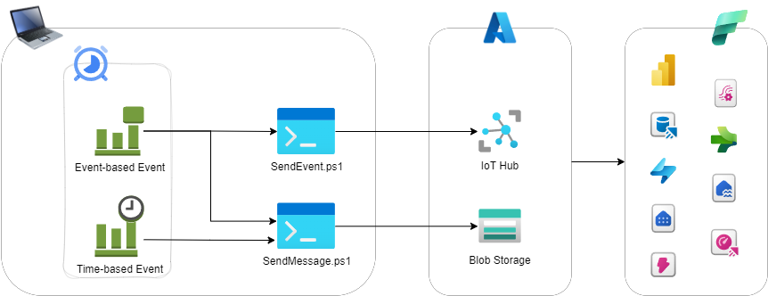

## Laptop as IoT device for Microsoft Cloud (PS+Azure+Fabric)

A template for fast-start your IoT/Real-Time analytics playground.

Contains of:
- Microsoft Azure bicep templates
- Bunch of PowerShell scripts to send telemetry and events to Azure

### The common scheme

### How to configure PS
Set of powershell scripts is attented to generate messages to Azure IoT Hub. there are two scenarios covered:
- Laptop stores telemetry parameters as a json message to Azure Cloud Blob Storage
- Laptop sends events to Azure IoT Hub

#### Prerequisites
- Windows machine 
- Administrative privelegies to setup
- Az.Storage cmdlet installed

#### Configuration
- Configure environment variables:
    - IOT_Container
    - IOT_DeviceID
    - IOT_HubName
    - IOT_SASToken_Blob
    - IOT_SASToken_EventHub

### How to Use Bicep files
> az login
>
> az deployment group create --resource-group ResourceGroupName --name laptopasiot --template-file ./Biceps/Main.bicep

*set your resource group instead of ResourceGroupName and name of deployment if needed*

### Manual Azure Cloud Configuration
- Laptop as a devices is added manually to Azure IoT Hub

> Azure scheme TBD

### Contacts
[LinkedIn Aleksei Zhukov](https://www.linkedin.com/in/alekseizhukov/)